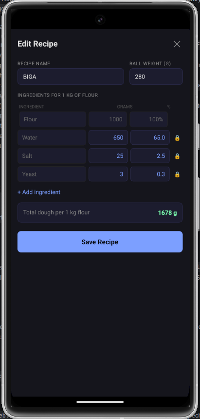
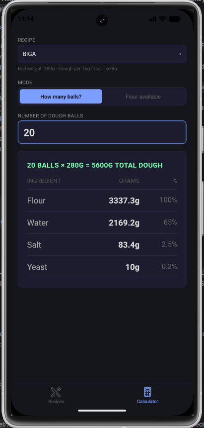

# Staglio Perfetto

A pizza dough recipe calculator for mobile — React Native / Expo app built by Nazar Prytuliak.

## Features

- **Recipe management** — create, edit, and delete pizza dough recipes with custom ingredients
- **Calculator** — compute ingredient quantities by number of dough balls or available flour weight
- **Baker's percentages** — enter grams or % interchangeably; values sync automatically
- **Persistent storage** — recipes are saved locally via AsyncStorage
- **Dark UI** — fully themed dark interface with tab navigation

## Screenshots

| Splash | Recipe Editor | Calculator |
|:---:|:---:|:---:|
|  |  |  |

## Tech stack

| Layer          | Tool                                      |
|----------------|-------------------------------------------|
| Framework | React Native + Expo (SDK 54) |
| Routing | expo-router (file-based) |
| State | Zustand with AsyncStorage persistence |
| Linting / Formatting | Biome |
| Testing | Jest + jest-expo |

## Project structure

```
app/
  index.tsx              # Splash screen → redirects to recipes
  (tabs)/
    _layout.tsx          # Tab navigator (Recipes + Calculator)
    recipes.tsx          # Recipe list screen
    calculator.tsx       # Calculator screen
bll/
  calculations.ts        # Pure business logic (no side effects)
dal/
  storage.ts             # AsyncStorage wrapper
store/
  recipeStore.ts         # Zustand store
components/
  RecipeCard.tsx
  RecipeForm.tsx
  IngredientRow.tsx
  CalculatorForm.tsx
types/
  recipe.ts              # Shared TypeScript types
lib/
  generateId.ts
```

## Commands

```bash
bun install              # install dependencies
bun run start            # start Expo dev server (QR + platform options)
bun run android          # target Android emulator
bun run ios              # target iOS simulator
bun run web              # target browser
bun run check            # Biome: lint + format check + import sort
bun run format           # Biome: auto-format all files
bun run test             # run all Jest tests
```

## Running on a real device

**Expo Go (quickest):** install Expo Go from the Play Store / App Store, connect to the same Wi-Fi, run `bun run start`, and scan the QR code.

**Standalone APK (Android):**
```bash
npm install -g eas-cli
eas login
eas build:configure
eas build -p android --profile preview
```
EAS provides a download link when the build finishes — install the APK directly on your device.